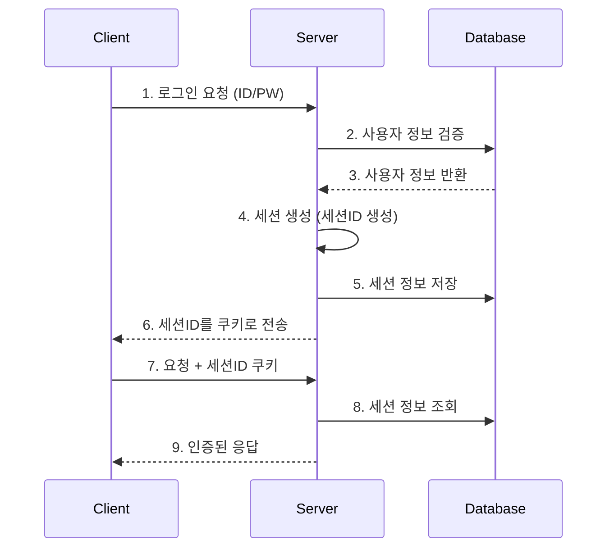
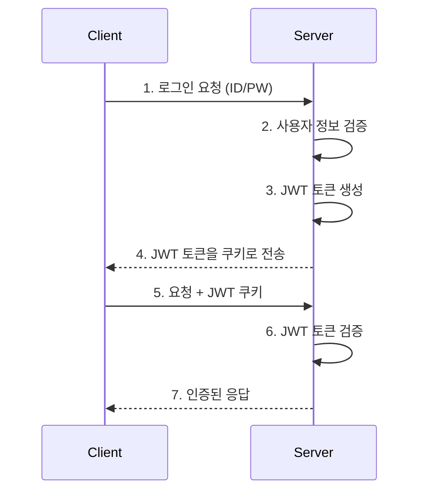

# Week 07 - 세션과 쿠키 기반 인증 시스템

## 📋 목차
1. [세션과 쿠키의 기본 개념](#1-세션과-쿠키의-기본-개념)
2. [상태 유지 전략 비교](#2-상태-유지-전략-비교)
3. [인증 흐름 이해](#3-인증-흐름-이해)
4. [실제 구현 예시](#4-실제-구현-예시)
5. [보안 고려사항](#5-보안-고려사항)

---

## 1. 세션과 쿠키의 기본 개념

### 1.1 쿠키 (Cookie)
- **정의**: 웹사이트가 브라우저에 저장하는 작은 텍스트 파일
- **용도**: 사용자 정보, 장바구니, 로그인 상태 등 저장
- **특징**: 
  - 클라이언트 측에 저장
  - 요청 시 자동으로 서버로 전송
  - 도메인별로 분리되어 저장

### 1.2 세션 (Session)
- **정의**: 서버 측에서 사용자별로 생성하는 임시 저장 공간
- **용도**: 로그인 상태, 사용자 정보 등 민감한 데이터 저장
- **특징**:
  - 서버 메모리 또는 DB에 저장
  - 세션 ID를 쿠키로 전달
  - 서버 재시작 시 초기화 (메모리 기반)

---

## 2. 상태 유지 전략 비교

| 구분 | 세션 기반 | 쿠키 기반 |
|------|-----------|-----------|
| **저장 위치** | 서버 (메모리/DB) | 클라이언트 (브라우저) |
| **보안성** | 높음 (서버에서 관리) | 낮음 (클라이언트 노출) |
| **용량 제한** | 서버 리소스에 따라 | 4KB (브라우저 제한) |
| **수명** | 서버 설정에 따라 | 만료일 설정 가능 |
| **확장성** | 서버 간 공유 어려움 | 도메인 내 자동 공유 |
| **성능** | 서버 조회 필요 | 클라이언트에서 즉시 접근 |

### 2.1 세션 기반 인증의 장단점

**장점:**
- 보안성이 높음 (민감한 정보를 서버에서 관리)
- 서버에서 세션 무효화 가능
- 클라이언트 조작 불가능

**단점:**
- 서버 메모리 사용량 증가
- 확장성 문제 (서버 간 세션 공유 어려움)
- 서버 재시작 시 세션 손실

### 2.2 쿠키 기반 인증의 장단점

**장점:**
- 서버 부하 감소
- 확장성 좋음
- 구현이 간단

**단점:**
- 보안 취약점 (XSS, CSRF 공격)
- 용량 제한
- 클라이언트 조작 가능

---

## 3. 인증 흐름 이해

### 3.1 세션 기반 인증 흐름



### 3.2 쿠키 기반 인증 흐름



---

## 4. 실제 구현 예시

### 4.1 Express.js + 세션 기반 인증

```javascript
// app.js
const express = require('express');
const session = require('express-session');
const app = express();

// 세션 미들웨어 설정
app.use(session({
  secret: 'your-secret-key',
  resave: false,
  saveUninitialized: false,
  cookie: {
    secure: process.env.NODE_ENV === 'production',
    httpOnly: true,
    maxAge: 24 * 60 * 60 * 1000 // 24시간
  }
}));

// 로그인 라우트
app.post('/login', (req, res) => {
  const { username, password } = req.body;
  
  // 사용자 인증 로직
  if (authenticateUser(username, password)) {
    req.session.userId = username;
    req.session.isAuthenticated = true;
    res.json({ success: true, message: '로그인 성공' });
  } else {
    res.status(401).json({ success: false, message: '로그인 실패' });
  }
});

// 인증 미들웨어
const requireAuth = (req, res, next) => {
  if (req.session && req.session.isAuthenticated) {
    next();
  } else {
    res.status(401).json({ message: '인증이 필요합니다' });
  }
};

// 보호된 라우트
app.get('/protected', requireAuth, (req, res) => {
  res.json({ message: '인증된 사용자만 접근 가능' });
});

// 로그아웃
app.post('/logout', (req, res) => {
  req.session.destroy((err) => {
    if (err) {
      res.status(500).json({ message: '로그아웃 실패' });
    } else {
      res.json({ message: '로그아웃 성공' });
    }
  });
});
```

### 4.2 React + 쿠키 기반 인증

```javascript
// authService.js
import Cookies from 'js-cookie';

export const authService = {
  // 로그인
  async login(username, password) {
    try {
      const response = await fetch('/api/login', {
        method: 'POST',
        headers: {
          'Content-Type': 'application/json',
        },
        body: JSON.stringify({ username, password }),
      });
      
      const data = await response.json();
      
      if (data.success) {
        // JWT 토큰을 쿠키에 저장
        Cookies.set('authToken', data.token, { 
          expires: 7, // 7일
          secure: process.env.NODE_ENV === 'production',
          sameSite: 'strict'
        });
        return true;
      }
      return false;
    } catch (error) {
      console.error('로그인 에러:', error);
      return false;
    }
  },

  // 로그아웃
  logout() {
    Cookies.remove('authToken');
  },

  // 인증 상태 확인
  isAuthenticated() {
    return !!Cookies.get('authToken');
  },

  // 토큰 가져오기
  getToken() {
    return Cookies.get('authToken');
  }
};
```

```javascript
// PrivateRoute.jsx
import React from 'react';
import { Navigate } from 'react-router-dom';
import { authService } from './authService';

const PrivateRoute = ({ children }) => {
  return authService.isAuthenticated() ? children : <Navigate to="/login" />;
};

export default PrivateRoute;
```

```javascript
// App.jsx
import React from 'react';
import { BrowserRouter, Routes, Route } from 'react-router-dom';
import Login from './components/Login';
import Dashboard from './components/Dashboard';
import PrivateRoute from './components/PrivateRoute';

function App() {
  return (
    <BrowserRouter>
      <Routes>
        <Route path="/login" element={<Login />} />
        <Route 
          path="/dashboard" 
          element={
            <PrivateRoute>
              <Dashboard />
            </PrivateRoute>
          } 
        />
      </Routes>
    </BrowserRouter>
  );
}

export default App;
```

### 4.3 JWT 토큰 검증 미들웨어

```javascript
// middleware/auth.js
const jwt = require('jsonwebtoken');

const verifyToken = (req, res, next) => {
  const token = req.cookies.authToken || req.headers.authorization?.split(' ')[1];
  
  if (!token) {
    return res.status(401).json({ message: '토큰이 없습니다' });
  }
  
  try {
    const decoded = jwt.verify(token, process.env.JWT_SECRET);
    req.user = decoded;
    next();
  } catch (error) {
    return res.status(401).json({ message: '유효하지 않은 토큰입니다' });
  }
};

module.exports = { verifyToken };
```

---

## 5. 보안 고려사항

### 5.1 세션 기반 보안

**권장사항:**
- 세션 ID는 충분히 긴 랜덤 문자열 사용
- HTTPS 사용 (secure 쿠키)
- HttpOnly 쿠키 사용 (XSS 방지)
- 세션 타임아웃 설정
- 서버 재시작 시 세션 백업

```javascript
app.use(session({
  secret: crypto.randomBytes(64).toString('hex'),
  resave: false,
  saveUninitialized: false,
  cookie: {
    secure: true, // HTTPS에서만 전송
    httpOnly: true, // JavaScript에서 접근 불가
    sameSite: 'strict', // CSRF 방지
    maxAge: 30 * 60 * 1000 // 30분
  }
}));
```

### 5.2 쿠키 기반 보안

**권장사항:**
- JWT 토큰 서명 검증
- 토큰 만료시간 설정
- Refresh Token 사용
- CSRF 토큰 사용

```javascript
// JWT 토큰 생성
const jwt = require('jsonwebtoken');

const generateToken = (user) => {
  return jwt.sign(
    { userId: user.id, username: user.username },
    process.env.JWT_SECRET,
    { expiresIn: '1h' }
  );
};

// Refresh Token 생성
const generateRefreshToken = (user) => {
  return jwt.sign(
    { userId: user.id },
    process.env.JWT_REFRESH_SECRET,
    { expiresIn: '7d' }
  );
};
```

### 5.3 일반적인 보안 위협

**XSS (Cross-Site Scripting):**
- HttpOnly 쿠키 사용
- 입력값 검증 및 이스케이프
- CSP (Content Security Policy) 설정

**CSRF (Cross-Site Request Forgery):**
- SameSite 쿠키 속성 사용
- CSRF 토큰 사용
- Referer 헤더 검증

**세션 하이재킹:**
- HTTPS 사용
- 세션 ID 재생성
- IP 주소 검증

---

## 📝 결론

세션과 쿠키 기반 인증은 각각의 장단점이 있으며, 프로젝트의 요구사항에 따라 적절한 방식을 선택해야 합니다.

- **세션 기반**: 보안이 중요한 경우, 서버에서 완전한 제어가 필요한 경우
- **쿠키 기반**: 확장성이 중요한 경우, 서버 부하를 줄이고 싶은 경우

실제 구현 시에는 보안을 최우선으로 고려하여 적절한 보안 조치를 적용해야 합니다.
